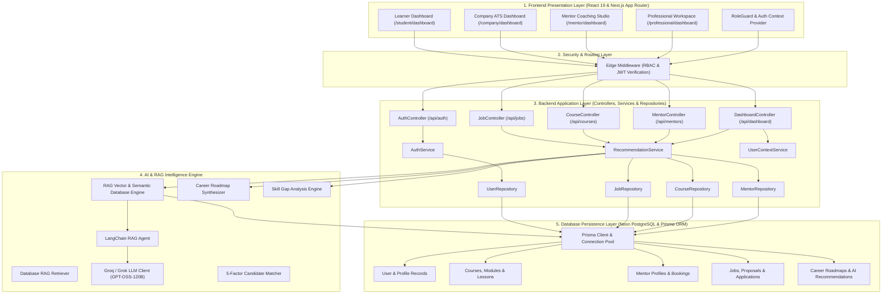

# Groearn Architecture & System Design Guide

> **Enterprise 4-Tier Architecture: Frontend • Backend • AI & RAG • Database**  
> *A comprehensive technical blueprint and interview walkthrough guide.*

---

## 🏛️ System Architecture Overview

Groearn is architected as an **enterprise-grade, full-stack career-to-earning ecosystem** combining Next.js App Router, stateless JWT authentication with Role-Based Access Control (RBAC), a custom Retrieval-Augmented Generation (RAG) vector database engine, and a PostgreSQL persistence layer managed by Prisma ORM.



---

## 📂 Project Directory Structure

```
g:\ufp\
├── prisma/                          # 🗄️ DATABASE PERSISTENCE TIER
│   ├── schema.prisma                # Relational schema (22 entity models)
│   ├── seed.ts                      # Production database seed script
│   └── dev.db                       # Local development cache
│
├── src/
│   ├── app/                         # 🎨 FRONTEND PAGES & API ROUTE HANDLERS
│   │   ├── (auth)/                  # Authentication Pages
│   │   │   ├── login/page.tsx       # Sign In with demo autofill
│   │   │   └── signup/page.tsx      # Sign Up with role selection
│   │   ├── student/                 # Learner / Student Workspace
│   │   │   └── dashboard/page.tsx   # Interactive RAG learning hub
│   │   ├── company/                 # Company / Employer Workspace
│   │   │   └── dashboard/page.tsx   # ATS candidate pipeline & job poster
│   │   ├── mentor/                  # Mentor Coaching Studio
│   │   │   └── dashboard/page.tsx   # 1-on-1 session manager & course publishing
│   │   ├── professional/            # Freelancer & Professional Workspace
│   │   │   └── dashboard/page.tsx   # Proposal generator & portfolio manager
│   │   ├── courses/                 # Public Course Catalog & Video Player
│   │   ├── jobs/                    # Dual Global/Local Job Board
│   │   ├── mentors/                 # Mentor Marketplace Directory
│   │   ├── feed/                    # Professional Community Feed
│   │   ├── messages/                # Real-time Conversation Drawer
│   │   ├── profile/                 # User Portfolio & Verified Skills
│   │   ├── ai-assistant/            # Conversational AI Career Advisor
│   │   └── api/                     # 🔌 REST API Route Handlers
│   │       ├── ai/                  # RAG Recommendations, Chat & Proposals
│   │       ├── auth/                # Login, Register, Logout, Me, Role-Select
│   │       ├── courses/             # Course listing, enrollment & progress
│   │       ├── dashboard/           # Aggregated workspace statistics
│   │       ├── jobs/                # Job queries & candidate applications
│   │       ├── mentors/             # Mentorship queries & booking requests
│   │       └── posts/               # Social feed queries & interactions
│   │
│   ├── components/                  # 🧩 REUSABLE UI & PRESENTATION COMPONENTS
│   │   ├── auth/                    # RoleGuard and route barrier wrappers
│   │   ├── layout/                  # Navbar, Sidebar, Footer, Navigation
│   │   ├── feed/                    # Post cards, quick poster, comment drawers
│   │   └── ui/                      # Atomic design primitives (Button, Card, Badge, Input, Avatar)
│   │
│   ├── context/                     # 🌐 CLIENT STATE MANAGEMENT
│   │   └── auth-context.tsx         # AuthProvider with instant session caching
│   │
│   ├── controllers/                 # 🎮 BACKEND API CONTROLLERS
│   │   ├── auth.controller.ts       # Registration, login, cookie session management
│   │   ├── job.controller.ts        # Job creation, filtering & query routing
│   │   ├── course.controller.ts     # Course catalog endpoints
│   │   ├── mentor.controller.ts     # Mentorship endpoints
│   │   ├── post.controller.ts       # Feed posts & community interaction
│   │   ├── dashboard.controller.ts  # Role statistics aggregator
│   │   └── index.ts                 # Unified controller barrel
│   │
│   ├── services/                    # ⚙️ BUSINESS LOGIC TIER
│   │   ├── auth.service.ts          # Password hashing, JWT signing, role resolution
│   │   ├── recommendation.service.ts# Multi-entity ranking and scoring
│   │   ├── user-context.service.ts  # User competency profile aggregation
│   │   └── index.ts                 # Unified service barrel
│   │
│   ├── repositories/                # 📦 DATA ACCESS LAYER (DAL)
│   │   ├── user.repository.ts       # User and profile CRUD
│   │   ├── job.repository.ts        # Job queries and applicant relations
│   │   ├── course.repository.ts     # Course, module, and lesson queries
│   │   ├── mentor.repository.ts     # Mentor profile queries
│   │   ├── post.repository.ts       # Post, like, and comment queries
│   │   └── index.ts                 # Unified repository barrel
│   │
│   ├── validators/                  # 🛡️ RUNTIME SCHEMA VALIDATION (ZOD)
│   │   ├── auth.schema.ts           # Login, registration, role update schemas
│   │   └── job.schema.ts            # Job posting validation schema
│   │
│   ├── lib/                         # 🧠 CORE ENGINES & INFRASTRUCTURE
│   │   ├── ai/                      # 🤖 AI & RAG SYSTEM TIER
│   │   │   ├── rag/                 # RAG Subsystem
│   │   │   │   ├── rag-database.ts  # TF-IDF & Vector Semantic Search Engine
│   │   │   │   ├── retriever.ts     # Grounded multi-entity document retriever
│   │   │   │   ├── langchain-agent.ts # LangChain agentic conversational loop
│   │   │   │   └── index.ts         # RAG barrel export
│   │   │   ├── grok-client.ts       # Groq/Grok high-speed LLM client with multi-model fallback
│   │   │   ├── roadmap.service.ts   # 4-Phase AI Roadmap Generator
│   │   │   ├── skill-analysis.service.ts # Radar gap analysis engine
│   │   │   ├── hybrid-matcher.ts    # 5-Factor Candidate-to-Job matcher
│   │   │   ├── ai-assistant.service.ts # High-level conversational synthesizer
│   │   │   └── index.ts             # AI module barrel export
│   │   ├── auth.ts                  # Server JWT verification & cookie utilities
│   │   ├── constants.ts             # System roles, navigation paths, demo personas
│   │   ├── prisma.ts                # PrismaClient singleton & database health checks
│   │   └── utils.ts                 # Response envelope helpers & formatting
│   │
│   └── middleware.ts                # 🚦 EDGE ROUTE PROTECTION & RBAC PROXY
```

---

## 🎯 4-Tier Architectural Breakdown

### 1. Presentation Tier (Frontend)
- **Framework**: Next.js 15 (App Router) + React 19.
- **Styling**: Tailwind CSS v4 design system with custom tokens and dark/light glassmorphic cards.
- **Client State**: `AuthProvider` with synchronous `localStorage` session caching and background server validation to eliminate unauthenticated screen flickers.
- **Route Guards**: `RoleGuard` wrapper components protecting each private dashboard on client-side router transitions.

### 2. Application Tier (Backend)
- **Design Pattern**: **Controller → Service → Repository (CSR)** enterprise pattern.
- **Controllers**: Handle HTTP serialization, parse parameters, and return standardized JSON responses (`apiSuccess`, `apiError`).
- **Services**: Execute domain business logic (ranking algorithms, role resolution, recommendation synthesis).
- **Repositories**: Encapsulate database queries and Prisma ORM data transformations.
- **Validation**: Strict Zod schemas validated before processing any write mutation.

### 3. Intelligence Tier (AI & RAG)
- **Vector & Semantic Search (`rag-database.ts`)**:
  - Tokenizes input queries into normalized unigrams and n-grams.
  - Computes weighted TF-IDF cosine relevance scores across database course titles, skills covered, category taxonomies, and mentor expertise profiles.
  - Guarantees strict top 5 ranking for courses and mentors matching the queried skill.
- **Roadmap Synthesis (`roadmap.service.ts`)**:
  - Dynamically constructs a tailored 4-phase learning trajectory with weekly pacing, core topics, hands-on tasks, and capstone projects.
- **LLM Client (`grok-client.ts`)**:
  - High-speed Groq API integration (`openai/gpt-oss-120b`) with deterministic rule-based offline fallback.

### 4. Persistence Tier (Database)
- **Database Engine**: Neon Serverless PostgreSQL with connection pooling.
- **ORM**: Prisma ORM with type-safe schema definitions.
- **Data Models**: 22 relational models covering Users, Profiles, UserSkills, Courses, CourseModules, Lessons, Enrollments, Certificates, MentorProfiles, MentorshipBookings, Jobs, Applications, Proposals, Posts, Comments, Likes, Notifications, and CareerRoadmaps.

---

## 🔒 Role-Based Access Control (RBAC) Matrix

| User Role | Allowed Dashboards | Restricted Dashboards | Action on Unauthorized Access |
| :--- | :--- | :--- | :--- |
| **LEARNER / STUDENT** | `/student/*`, `/feed`, `/jobs`, `/courses`, `/mentors`, `/profile`, `/ai-assistant` | `/company/*`, `/employer/*`, `/mentor/*`, `/professional/*`, `/freelancer/*` | Auto-redirect to `/student/dashboard` |
| **EMPLOYER / COMPANY** | `/company/*`, `/feed`, `/jobs`, `/courses`, `/mentors`, `/profile`, `/ai-assistant` | `/student/*`, `/mentor/*`, `/professional/*`, `/freelancer/*` | Auto-redirect to `/company/dashboard` |
| **MENTOR** | `/mentor/*`, `/feed`, `/jobs`, `/courses`, `/mentors`, `/profile`, `/ai-assistant` | `/student/*`, `/company/*`, `/employer/*`, `/professional/*`, `/freelancer/*` | Auto-redirect to `/mentor/dashboard` |
| **PROFESSIONAL / FREELANCER** | `/professional/*`, `/freelancer/*`, `/feed`, `/jobs`, `/courses`, `/mentors`, `/profile`, `/ai-assistant` | `/student/*`, `/company/*`, `/employer/*`, `/mentor/*` | Auto-redirect to `/professional/dashboard` |
| **GUEST (Unauthenticated)** | `/`, `/login`, `/signup`, `/feed`, `/jobs`, `/courses`, `/mentors` | All `*/dashboard` routes and `/onboarding` | Auto-redirect to `/login?redirect=...` |

---

## 🎤 Interview Cheatsheet & Talking Points

### Q1: "How does the RAG system work in your application?"
> **Answer**:  
> *"Our RAG system is grounded directly in our live PostgreSQL application database. When a student chooses or types a skill (like Java & Spring Boot or Generative AI), our RAG Engine tokenizes the query into unigrams and n-grams and executes a weighted TF-IDF cosine similarity search across indexed courses and mentor profiles. It scores candidate items on title tokens, skills covered, and domain expertise to return the Top 5 most relevant courses and Top 5 expert mentors, alongside a synthesized 4-phase learning roadmap."*

### Q2: "How did you implement Role-Based Route Protection?"
> **Answer**:  
> *"We implemented a defense-in-depth security model:  
> 1. **Server Edge Middleware (`src/middleware.ts`)**: Decodes the HTTP-only JWT using `jose` before routes render and prevents unauthorized cross-role access (e.g., employers accessing student pages or students accessing employer ATS dashboards).  
> 2. **Client-side `RoleGuard` Component**: Enforces layout-level authorization during client-side router transitions with synchronous session hydration to prevent blank white screens."*

### Q3: "What architectural pattern does the backend follow?"
> **Answer**:  
> *"The backend follows the **Controller-Service-Repository (CSR)** pattern:  
> - **Controllers (`src/controllers/`)** handle HTTP requests, headers, and validation errors.  
> - **Services (`src/services/`)** encapsulate business rules, RAG ranking, and recommendation synthesis.  
> - **Repositories (`src/repositories/`)** manage data access through Prisma ORM."*

### Q4: "How does the frontend handle authentication state without hydration flicker?"
> **Answer**:  
> *"We use an `AuthProvider` with instant session caching. Upon login, the user profile is stored synchronously in React state and local session cache, allowing pages to render immediately without waiting for an asynchronous network round-trip to `/api/auth/me` on every navigation."*

### Q5: "How does the system ensure zero downtime if the external LLM provider fails?"
> **Answer**:  
> *"Our AI Engine uses a **Multi-Tier Fallback Architecture**. If the Groq LLM API is unavailable, the system automatically falls back to our deterministic rule-based heuristic engine in `src/lib/ai/`, guaranteeing that roadmaps, skill analyses, and candidate scores are always returned without throwing 500 errors."*
