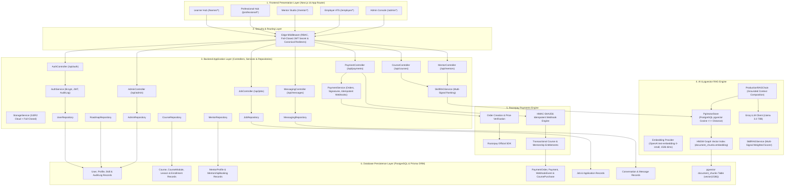

# GroEarn — Production Architecture & Engineering Specification

> **Enterprise Multi-Role Career Platform: Learner • Professional • Mentor • Employer • Admin**  
> *End-to-end full-stack platform built with Next.js 16 App Router, PostgreSQL + pgvector, OpenAI RAG, Razorpay Payments, Prisma ORM, and Zero-Trust RBAC.*

---

## 🏛️ System Architecture Overview

GroEarn is built as a **modular monolith** that connects the full career lifecycle:
**Learn → Build Skills → Get Guidance → Earn → Grow → Mentor**


```mermaid
graph TD
    subgraph Presentation_Layer["1. Frontend Presentation Layer (Next.js 16 App Router)"]
        UI_Learner["Learner Hub (/learner/*)"]
        UI_Pro["Professional Hub (/professional/*)"]
        UI_Mentor["Mentor Studio (/mentor/*)"]
        UI_Employer["Employer ATS (/employer/*)"]
        UI_Admin["Admin Console (/admin/*)"]
    end

    subgraph Security_Routing["2. Security & Routing Layer"]
        MW["Edge Middleware (RBAC, Fail-Closed JWT Secret & Canonical Redirects)"]
    end

    subgraph Application_Layer["3. Backend Application Layer (Controllers, Services & Repositories)"]
        Ctrl_Auth["AuthController (/api/auth)"]
        Ctrl_Job["JobController (/api/jobs)"]
        Ctrl_Course["CourseController (/api/courses)"]
        Ctrl_Mentor["MentorController (/api/mentors)"]
        Ctrl_Payment["PaymentController (/api/payments)"]
        Ctrl_Msg["MessagingController (/api/messages)"]
        Ctrl_Admin["AdminController (/api/admin)"]
        
        Svc_Auth["AuthService (Bcrypt, JWT, AuditLog)"]
        Svc_Payment["PaymentService (Orders, Signatures, Idempotent Webhooks)"]
        Svc_SkillRAG["SkillRAGService (Multi-Signal Ranking)"]
        Svc_Storage["StorageService (S3/R2 Cloud + Fail-Closed)"]
        
        Repo_User["UserRepository"]
        Repo_Job["JobRepository"]
        Repo_Course["CourseRepository"]
        Repo_Mentor["MentorRepository"]
        Repo_Msg["MessagingRepository"]
        Repo_Roadmap["RoadmapRepository"]
        Repo_Admin["AdminRepository"]
    end

    subgraph AI_RAG_Layer["4. AI & pgvector RAG Engine"]
        Embeddings["Embedding Provider (OpenAI text-embedding-3-small, 1536 dims)"]
        VectorStore["PgVectorStore (PostgreSQL pgvector Cosine <=> Distance)"]
        HNSW["HNSW Graph Vector Index (document_chunks.embedding)"]
        Skill_RAG["SkillRAGService (Multi-Signal Weighted Scorer)"]
        RAG_Chain["ProductionRAGChain (Grounded Context Composition)"]
        LLM_Client["Groq LLM Client (Llama 3.3 70B)"]
    end

    subgraph Payments_Layer["5. Razorpay Payments Engine"]
        RZP_SDK["Razorpay Official SDK"]
        RZP_Orders["Order Creation & Price Verification"]
        RZP_Webhook["HMAC-SHA256 Idempotent Webhook Engine"]
        RZP_Entitlements["Transactional Course & Mentorship Entitlements"]
    end

    subgraph Persistence_Layer["6. Database Persistence Layer (PostgreSQL & Prisma ORM)"]
        DB_Users["User, Profile, Skill & AuditLog Records"]
        DB_Courses["Course, CourseModule, Lesson & Enrollment Records"]
        DB_Mentors["MentorProfile & MentorshipBooking Records"]
        DB_Payments["PaymentOrder, Payment, WebhookEvent & CoursePurchase"]
        DB_Jobs["Job & Application Records"]
        DB_Msg["Conversation & Message Records"]
        DB_PgVector["pgvector document_chunks Table (vector(1536))"]
    end

    UI_Learner --> MW
    UI_Pro --> MW
    UI_Mentor --> MW
    UI_Employer --> MW
    UI_Admin --> MW

    MW --> Ctrl_Auth
    MW --> Ctrl_Job
    MW --> Ctrl_Course
    MW --> Ctrl_Mentor
    MW --> Ctrl_Payment
    MW --> Ctrl_Msg
    MW --> Ctrl_Admin

    Ctrl_Auth --> Svc_Auth
    Ctrl_Course --> Svc_SkillRAG
    Ctrl_Mentor --> Svc_SkillRAG
    Ctrl_Payment --> Svc_Payment
    Ctrl_Job --> Repo_Job
    Ctrl_Msg --> Repo_Msg
    Ctrl_Admin --> Repo_Admin

    Svc_Payment --> RZP_Orders
    RZP_Orders --> RZP_SDK
    Ctrl_Payment --> RZP_Webhook
    RZP_Webhook --> RZP_Entitlements
    RZP_Entitlements --> DB_Payments

    Svc_SkillRAG --> VectorStore
    VectorStore --> HNSW
    HNSW --> DB_PgVector
    RAG_Chain --> VectorStore
    RAG_Chain --> LLM_Client

    Svc_Auth --> Repo_User
    Repo_User --> DB_Users
    Repo_Job --> DB_Jobs
    Repo_Course --> DB_Courses
    Repo_Mentor --> DB_Mentors
    Repo_Msg --> DB_Msg
    Repo_Roadmap --> DB_Users
    Repo_Admin --> DB_Users
```

---

## 🔒 Security Architecture & Role Escalation Prevention

1. **Strict RBAC Enforcement:**
   - Public registration endpoints (`/api/auth/register`, `/api/auth/role-select`) reject the `ADMIN` role via Zod validation schemas and `AuthService` guards.
   - Admin accounts can only be assigned through direct database migrations or authorized administrative operations.
2. **Fail-Closed JWT Secret Enforcement:**
   - Missing or short ($< 32$ chars) `JWT_SECRET` throws fatal startup exceptions.
   - Tokens stored in `HttpOnly`, `SameSite=lax`, `Secure` cookies.
3. **Audit Logging & Telemetry:**
   - Immutable security audit logs recorded for every authentication attempt, payment lifecycle event, and administrative mutation.
4. **Ownership Verification & IDOR Prevention:**
   - Messaging: Users only access conversations where they are verified participants.
   - Jobs: Employers only edit, close, or view applicants for jobs created by their organization.
   - Mentors: Mentors only access requests directed to their mentor profile.
   - Payments: Users can only query their own payments; mentors can only inspect payments for their offerings; admins have system oversight.

---

## 🧭 Canonical Role-Based Routing

| Role | Canonical Root | Accessible Features |
|---|---|---|
| **LEARNER** | `/learner/dashboard` | Skill-First RAG Discovery, Database Roadmaps, Top 5 Courses/Mentors, Paid Course Checkout, 1-on-1 Mentorship Bookings |
| **PROFESSIONAL** | `/professional/dashboard` | Semantic Job Matching, 5-Factor Hybrid Match Scoring, Application Submission, Application Pipeline Tracker (`/professional/applications`), Portfolio & Resume Management |
| **MENTOR** | `/mentor/dashboard` | Mentor Profile Management, Paid Course Publishing Studio (`/mentor/courses/new`), Mentorship Request Approvals (`/mentor/requests`), Mentor Earnings Telemetry |
| **EMPLOYER** | `/employer/dashboard` | Job Creation & Publishing (`/employer/jobs/new`), Semantic Candidate Search, Applicant Pipeline (`/employer/jobs/[id]/applicants`), Candidate Status Transitions |
| **ADMIN** | `/admin/dashboard` | User Management (`/admin/users`), Course Moderation (`/admin/courses`), Job Moderation (`/admin/jobs`), Security Audit Logs (`/admin/audit`), Real-Time Platform Telemetry |

---

## 🧠 AI, Vector Retrieval & Multi-Signal Scoring

GroEarn enforces a clean separation of concerns:
```text
PostgreSQL (Source of Truth)
        ↓
pgvector Cosine Retrieval / Semantic Search (<=> operator)
        ↓
Deterministic Multi-Signal Business Ranking
        ↓
LLM Grounded Personalization & Explanation
        ↓
Structured User Response
```

### Multi-Signal Ranking Formula
Recommendations do not rely on hardcoded scores or fake confidence claims. Instead, candidate items are ranked using a multi-factor transparent formula:
$$\text{Final Score} = (\text{Vector Similarity} \times 0.35) + (\text{Skill Overlap} \times 0.35) + (\text{Quality Rating} \times 0.15) + (\text{Level Match} \times 0.15)$$

---

## 🧪 Verification & Automated Testing Suite

All tests can be executed via the standard commands:

```bash
# 1. Generate Prisma Client
npx prisma generate

# 2. Deploy Prisma Database Migrations
npx prisma migrate deploy

# 3. Seed Production Database
npm run seed

# 4. Run TypeScript Typecheck
npm run typecheck

# 5. Run ESLint Quality Check
npm run lint

# 6. Run Master Automated Test Suite (45/45 Tests)
npm test

# 7. Run Semantic RAG Infrastructure Proof
npm run test:rag:proof

# 8. Run Realistic Concurrent Benchmark
npm run test:load

# 9. Run Next.js Production Build
npm run build
```
