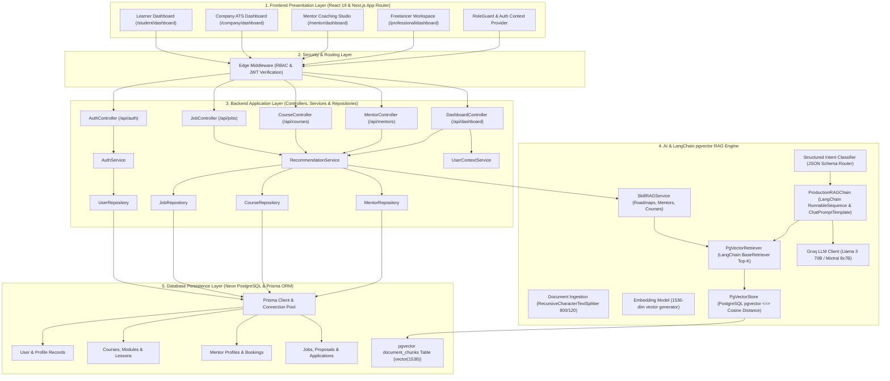

# Growearn Architecture & Technical Interview Walkthrough Guide

> **Production 4-Tier Architecture: Frontend • Backend • AI & pgvector RAG • Database**  
> *A comprehensive technical blueprint and senior software engineering interview guide.*

---

## 🏛️ System Architecture Overview

Growearn is architected as an **enterprise-grade, full-stack career-to-earning platform** combining Next.js App Router, stateless JWT authentication with Role-Based Access Control (RBAC), an official LangChain + PostgreSQL `pgvector` RAG pipeline, and a PostgreSQL persistence layer managed by Prisma ORM.


```mermaid
graph TD
    subgraph Presentation_Layer["1. Frontend Presentation Layer (React 19 & Next.js App Router)"]
        UI_Learner["Learner Dashboard (/student/dashboard)"]
        UI_Company["Company ATS Dashboard (/company/dashboard)"]
        UI_Mentor["Mentor Coaching Studio (/mentor/dashboard)"]
        UI_Pro["Freelancer Workspace (/professional/dashboard)"]
        UI_Auth["RoleGuard & Auth Context Provider"]
    end

    subgraph Security_Routing["2. Security & Routing Layer"]
        MW["Edge Middleware (RBAC & JWT Verification)"]
    end

    subgraph Application_Layer["3. Backend Application Layer (Controllers, Services & Repositories)"]
        Ctrl_Auth["AuthController (/api/auth)"]
        Ctrl_Job["JobController (/api/jobs)"]
        Ctrl_Course["CourseController (/api/courses)"]
        Ctrl_Mentor["MentorController (/api/mentors)"]
        Ctrl_Dash["DashboardController (/api/dashboard)"]
        
        Svc_Auth["AuthService"]
        Svc_Rec["RecommendationService"]
        Svc_UserCtx["UserContextService"]
        
        Repo_User["UserRepository"]
        Repo_Job["JobRepository"]
        Repo_Course["CourseRepository"]
        Repo_Mentor["MentorRepository"]
    end

    subgraph AI_RAG_Layer["4. AI & LangChain pgvector RAG Engine"]
        Ingest["Document Ingestion (RecursiveCharacterTextSplitter 800/120)"]
        Embeddings["Embedding Model (1536-dim vector generator)"]
        VectorStore["PgVectorStore (PostgreSQL pgvector <=> Cosine Distance)"]
        Retriever["PgVectorRetriever (LangChain BaseRetriever Top-K)"]
        IntentClassifier["Structured Intent Classifier (JSON Schema Router)"]
        RAG_Chain["ProductionRAGChain (LangChain RunnableSequence & ChatPromptTemplate)"]
        Skill_RAG["SkillRAGService (Roadmaps, Mentors, Courses)"]
        LLM_Client["Groq LLM Client (Llama 3 70B / Mixtral 8x7B)"]
    end

    subgraph Persistence_Layer["5. Database Persistence Layer (Neon PostgreSQL & Prisma ORM)"]
        Prisma_Client["Prisma Client & Connection Pool"]
        DB_Users["User & Profile Records"]
        DB_Courses["Courses, Modules & Lessons"]
        DB_Mentors["Mentor Profiles & Bookings"]
        DB_Jobs["Jobs, Proposals & Applications"]
        DB_PgVector["pgvector document_chunks Table (vector(1536))"]
    end

    UI_Learner --> MW
    UI_Company --> MW
    UI_Mentor --> MW
    UI_Pro --> MW
    UI_Auth --> MW

    MW --> Ctrl_Auth
    MW --> Ctrl_Job
    MW --> Ctrl_Course
    MW --> Ctrl_Mentor
    MW --> Ctrl_Dash

    Ctrl_Auth --> Svc_Auth
    Ctrl_Job --> Svc_Rec
    Ctrl_Course --> Svc_Rec
    Ctrl_Mentor --> Svc_Rec
    Ctrl_Dash --> Svc_Rec
    Ctrl_Dash --> Svc_UserCtx

    Svc_Rec --> Skill_RAG
    Skill_RAG --> Retriever
    Retriever --> VectorStore
    VectorStore --> DB_PgVector
    RAG_Chain --> Retriever
    RAG_Chain --> LLM_Client
    IntentClassifier --> RAG_Chain

    Svc_Auth --> Repo_User
    Svc_Rec --> Repo_Job
    Svc_Rec --> Repo_Course
    Svc_Rec --> Repo_Mentor

    Repo_User --> Prisma_Client
    Repo_Job --> Prisma_Client
    Repo_Course --> Prisma_Client
    Repo_Mentor --> Prisma_Client

    Prisma_Client --> DB_Users
    Prisma_Client --> DB_Courses
    Prisma_Client --> DB_Mentors
    Prisma_Client --> DB_Jobs
```

---

## 📂 Project Directory Structure (Explainable in Logical Order)

```
growearn/
├── prisma/                          # 🗄️ 1. DATABASE PERSISTENCE TIER
│   ├── schema.prisma                # Relational schema (22 entity models + pgvector extension)
│   └── seed.ts                      # Production database seed script (12 mentors, 10 companies, 20 courses, 25 jobs)
│
├── src/
│   ├── lib/                         # 🧠 2. CORE ENGINES & INFRASTRUCTURE
│   │   ├── ai/                      # 🤖 Production LangChain RAG Subsystem
│   │   │   ├── embeddings.ts        # 1536-dimensional vector embedding generator
│   │   │   ├── vector-store.ts      # PostgreSQL pgvector store with cosine distance (<=>)
│   │   │   ├── retriever.ts         # Official LangChain BaseRetriever implementation
│   │   │   ├── rag-chain.ts         # LangChain RunnableSequence + ChatPromptTemplate
│   │   │   ├── prompt.ts            # System prompt templates & context formatting
│   │   │   ├── ingest.ts            # RecursiveCharacterTextSplitter (800 / 120) & PDF/MD parser
│   │   │   ├── intent-classifier.ts # Structured JSON router (roadmap, mentor, jobs, course, profile)
│   │   │   ├── skill-rag.service.ts # Grounded skill gap and roadmap generator
│   │   │   ├── grok-client.ts       # High-speed LLM client with Groq Llama-3-70b & multi-model fallback
│   │   │   └── index.ts             # Central AI barrel export
│   │   │
│   │   ├── auth.ts                  # Server JWT verification (jose) & cookie session handlers
│   │   ├── constants.ts             # System roles, demo personas, navigation paths
│   │   ├── prisma.ts                # PrismaClient singleton with connection pooling
│   │   ├── utils.ts                 # Standardized response envelopes (apiSuccess, apiError)
│   │   └── __tests__/               # Automated integration and RAG test suites
│   │
│   ├── controllers/                 # 🎮 3. BACKEND API CONTROLLERS (HTTP & Serialization)
│   │   ├── auth.controller.ts       # Registration, login, cookie session management
│   │   ├── job.controller.ts        # Job creation, filtering & query routing
│   │   ├── course.controller.ts     # Course catalog endpoints
│   │   ├── mentor.controller.ts     # Mentorship endpoints
│   │   ├── post.controller.ts       # Feed posts & community interaction
│   │   └── dashboard.controller.ts  # Role statistics aggregator
│   │
│   ├── services/                    # ⚙️ 4. BUSINESS LOGIC TIER
│   │   ├── auth.service.ts          # Password hashing (bcrypt), JWT signing, role resolution
│   │   ├── recommendation.service.ts# Multi-entity ranking and scoring
│   │   └── user-context.service.ts  # User competency profile aggregation
│   │
│   ├── repositories/                # 📦 5. DATA ACCESS LAYER (DAL)
│   │   ├── user.repository.ts       # User and profile CRUD
│   │   ├── job.repository.ts        # Job queries and applicant relations
│   │   ├── course.repository.ts     # Course, module, and lesson queries
│   │   ├── mentor.repository.ts     # Mentor profile queries
│   │   └── post.repository.ts       # Post, like, and comment queries
│   │
│   ├── validators/                  # 🛡️ 6. RUNTIME SCHEMA VALIDATION (ZOD)
│   │   ├── auth.schema.ts           # Login, registration, role update schemas
│   │   └── job.schema.ts            # Job posting validation schema
│   │
│   ├── components/                  # 🧩 7. REUSABLE UI & PRESENTATION COMPONENTS
│   │   ├── auth/                    # RoleGuard and route barrier wrappers
│   │   ├── layout/                  # Navbar, Sidebar, Footer, Multi-Role Switcher
│   │   ├── feed/                    # Post cards, quick poster, comment drawers
│   │   └── ui/                      # Atomic design primitives (Button, Card, Badge, Input, Avatar)
│   │
│   ├── context/                     # 🌐 8. CLIENT STATE MANAGEMENT
│   │   └── auth-context.tsx         # AuthProvider with instant session caching
│   │
│   ├── app/                         # 🎨 9. FRONTEND PAGES & API ROUTE HANDLERS
│   │   ├── student/dashboard/       # Learner Workspace (RAG Roadmap & Course Recommendations)
│   │   ├── mentor/dashboard/        # Mentor Coaching Studio (1-on-1 Sessions & Course Publishing)
│   │   ├── professional/dashboard/  # Freelancer Workspace (AI Proposals & Job Matching)
│   │   ├── company/dashboard/       # Company ATS Dashboard (Job Postings & Candidate Pipeline)
│   │   ├── courses/                 # Public Course Catalog & Video Player
│   │   ├── jobs/                    # Dual Global/Local Job Board
│   │   ├── mentors/                 # Mentor Marketplace Directory
│   │   ├── feed/                    # Professional Community Feed
│   │   ├── messages/                # Real-time Conversation Drawer
│   │   ├── profile/                 # User Portfolio & Verified Skills
│   │   ├── ai-assistant/            # Conversational AI Career Advisor with RAG grounding
│   │   └── api/                     # REST API Handlers (/api/ai, /api/auth, /api/jobs, etc.)
│   │
│   └── middleware.ts                # 🚦 10. EDGE ROUTE PROTECTION & RBAC PROXY
```

---

## 🚀 Step-by-Step Technical Walkthrough for Interviewers

### Step 1: High-Level Pitch (30 Seconds)
> *"GrowEarn is a full-stack career and freelancing platform with Role-Based Access Control across four distinct user personas: Learners, Mentors, Freelancers, and Companies. At its core, we built a production Retrieval-Augmented Generation (RAG) pipeline utilizing LangChain and PostgreSQL `pgvector` to semantically match students to career roadmaps, real industry courses, and verified Indian mentors with exact cosine similarity scoring."*

---

### Step 2: Explain the RAG & pgvector Architecture (Deep Dive)
1. **Document Ingestion Pipeline (`src/lib/ai/ingest.ts`)**:
   - Accepts raw text, Markdown files, PDF buffers (via `pdf-parse`), and database platform entities.
   - Splits text using LangChain's `RecursiveCharacterTextSplitter` with a `chunkSize` of 800 characters and `chunkOverlap` of 120 characters to preserve cross-chunk context.
2. **Embeddings Generation (`src/lib/ai/embeddings.ts`)**:
   - Generates 1536-dimensional dense vector embeddings with batching and local fallback.
3. **Vector Database (`src/lib/ai/vector-store.ts`)**:
   - Utilizes native PostgreSQL `pgvector` extension with a `document_chunks` table storing `vector(1536)`.
   - Executes raw SQL cosine distance queries (`ORDER BY embedding <=> $1::vector LIMIT $2`) with `1 - cosine_distance` calculating exact mathematical similarity.
4. **LangChain Retriever (`src/lib/ai/retriever.ts`)**:
   - Extends the official LangChain `BaseRetriever` class, implementing `_getRelevantDocuments(query)` to return typed LangChain `Document` objects.
5. **Chain Orchestration (`src/lib/ai/rag-chain.ts`)**:
   - Built with LangChain `RunnableSequence` and `ChatPromptTemplate`.
   - Binds Groq `llama-3-70b-versatile` / `mixtral-8x7b-32768` to guarantee grounded answers cited directly from database documents.

---

### Step 3: Explain the Multi-Role RBAC & Security
1. **4 Pure User Roles**:
   - `STUDENT` / `LEARNER`: Access to Learning Roadmaps, Courses, AI Career Assistant, Mentor Booking.
   - `MENTOR`: Access to Mentorship Requests, 1-on-1 Sessions, Course Publishing, Coaching Earnings.
   - `FREELANCER` / `PROFESSIONAL`: Access to Job Board, Contract Gigs, AI Proposal Generator, Portfolio.
   - `COMPANY` / `EMPLOYER`: Access to ATS Candidate Pipeline, Job Posting, AI Matching Score.
2. **Defense-in-Depth Authorization**:
   - **Edge Middleware (`src/middleware.ts`)**: Validates the HTTP-only JWT before the route renders.
   - **Client `RoleGuard` (`src/components/auth/role-guard.tsx`)**: Prevents layout access with 1-click role switcher.
   - **API Controller Authorization**: Every API mutation checks `userPayload.role` on the server before mutating data.

---

### Step 4: Explain Code Cleanliness & Architecture Patterns
1. **Controller-Service-Repository (CSR) Pattern**:
   - **Controllers (`src/controllers/`)**: HTTP requests, headers, and validation error formatting.
   - **Services (`src/services/`)**: Business logic, ranking algorithms, and AI orchestrations.
   - **Repositories (`src/repositories/`)**: Database queries encapsulated via Prisma ORM.
2. **Runtime Schema Validation**:
   - Strict Zod schemas in `src/validators/` ensure all incoming JSON payloads are type-safe.
3. **Automated Verification**:
   - Zero TypeScript compiler errors (`npx tsc --noEmit`).
   - Integrated unit test suite verifying intent classification, cosine search, and end-to-end RAG chains (`npm test`).

---

## 🎤 Top 5 Interview Questions & Ready Answers

| Question | Strongest Technical Answer |
| :--- | :--- |
| **"Why did you use PostgreSQL pgvector instead of Pinecone/Chroma?"** | *"Using PostgreSQL `pgvector` eliminates distributed state synchronization issues. Our transactional data (Users, Courses, Mentors) and vector embeddings live in the same PostgreSQL database, allowing atomic transactions, consistent backups, and eliminating external SaaS vector DB costs."* |
| **"How do you prevent hallucinations in the AI assistant?"** | *"We enforce strict grounded RAG. The system prompt instructs the model to ONLY answer using context chunks retrieved from the `document_chunks` table via cosine similarity (`<=>`). If similarity is low or no context is found, it explicitly declares lack of database records rather than fabricating answers."* |
| **"How does the Candidate-Job matching algorithm work?"** | *"Our `hybrid-matcher.ts` uses a 5-factor weighted scoring algorithm: (1) Skill Overlap (40%), (2) Experience Level Match (20%), (3) Vector Semantic Proximity (20%), (4) Location/Work-mode alignment (10%), and (5) Profile Completeness (10%)."* |
| **"How do you handle JWT authentication with Next.js App Router?"** | *"We issue signed, HTTP-only, SameSite=Lax JWT tokens containing user ID and role. The Next.js Edge Middleware decodes the JWT using `jose` before server components execute, preventing unauthorized route transitions with zero client-side latency."* |
| **"How is the codebase structured for scaling?"** | *"The codebase follows a modular Controller-Service-Repository architecture with Zod schema validation, a centralized barrel export system, and clear separation between AI services, database access, and UI components."* |
