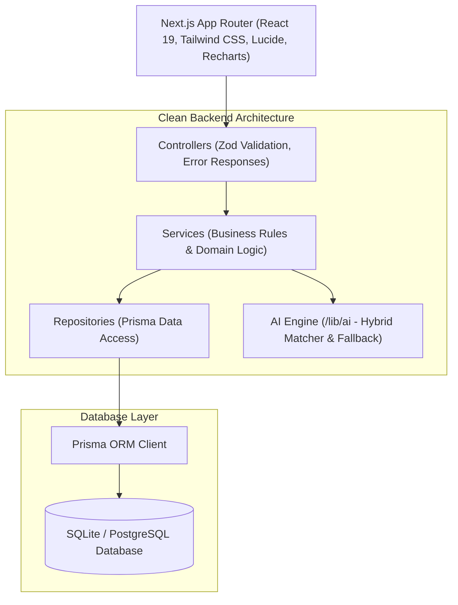

# Unified Freelancing Platform (UFP)
> **“Learn. Earn. Work. Grow — All in One.”**

An AI-powered professional ecosystem unifying **E-Learning (Udemy)**, **Freelance & Local Jobs (Upwork)**, **1-on-1 Mentorship**, **Professional Networking (LinkedIn)**, and an **AI Career Assistant** into one connected platform.

---

## 🌟 Key Features

- **Unified Identity Evolution**: Users start as a Student $\rightarrow$ Freelancer $\rightarrow$ Professional $\rightarrow$ Mentor $\rightarrow$ Hiring Company.
- **5-Factor Explainable AI Matcher**:
  $$\text{Score} = (\text{Skills} \times 50\%) + (\text{Experience} \times 20\%) + (\text{Location} \times 10\%) + (\text{Goal} \times 10\%) + (\text{AI Semantic} \times 10\%)$$
- **Local & Global Job Discovery**: Extensible `JobProvider` architecture supporting remote worldwide projects and on-site local gigs (e.g., Chennai, Tamil Nadu).
- **AI Proposal Generator**: Generate custom milestone proposals with timeline and architecture breakdowns.
- **Interactive Course System**: Video player, module progress tracking, mock payment checkout, and automated certificates.
- **1-on-1 Mentorship Marketplace**: Hourly rate coaching, session booking requests, and integrated video meeting rooms.
- **AI Communication Assistant**: Live message tone polisher (Professional, Friendly, Concise, Persuasive, Grammar Fix).
- **Professional Feed**: Share achievements, project launches, certifications, and hiring announcements.

---

## 🚀 Quick Start & Demo Accounts

### 1. Install & Setup
```bash
# Clone and install dependencies
npm install

# Push database schema & generate Prisma client
npx prisma db push

# Seed database with realistic users, courses, jobs, and posts
npm run seed

# Run local development server
npm run dev
```
Open [http://localhost:3000](http://localhost:3000) in your browser.

### 2. Pre-Seeded Demo Accounts (Password: `Demo1234!`)
| Role | Email | Purpose |
|---|---|---|
| **👨‍🎓 Student** | `student@example.com` | AI Skill Gap Analysis, Course Progress, Career Roadmap |
| **💼 Freelancer** | `freelancer@example.com` | Local/Global Jobs, Resume Parsing, AI Proposal Generator |
| **👨‍🏫 Mentor** | `mentor@example.com` | Student Coaching Requests, Video Meetings, Course Publishing |
| **🏢 Company** | `company@example.com` | Post Jobs, AI Talent Search, Applicant Tracking Pipeline |

*Tip: The Landing Page and Login Page include 1-click autofill buttons for instant testing.*

---

## 🏗️ Architecture & Layered Structure



---

## 📁 Project Structure

```
g:/ufp/
├── src/
│   ├── app/                    # Next.js App Router (Pages & API Routes)
│   │   ├── api/                # REST API Endpoints (Auth, Jobs, Courses, AI, Mentors, Posts)
│   │   ├── student/dashboard   # Student Learning Hub & AI Skill Profiling
│   │   ├── freelancer/dashboard# Freelancer Workspace & AI Proposal Generator
│   │   ├── mentor/dashboard    # Mentor Coaching Studio & Request Management
│   │   ├── company/dashboard   # Hiring Pipeline & Candidate Search
│   │   ├── feed/               # Professional Social Feed
│   │   ├── jobs/               # Global & Local Job Directory
│   │   ├── courses/            # Interactive Course Catalog & Video Player
│   │   ├── mentors/            # Mentor Directory & 1-on-1 Booking
│   │   ├── ai-assistant/       # AI Career Advisor & Message Polisher
│   │   └── profile/            # Dynamic Portfolio & Skills Management
│   ├── components/             # Reusable UI & Layout Components
│   ├── context/                # Client Auth Context & Role Switcher
│   ├── controllers/            # API Route Controllers
│   ├── services/               # Business Service Layer
│   ├── repositories/           # Database Query Repositories
│   ├── validators/             # Zod Validation Schemas
│   └── lib/                    # Prisma Singleton, Auth JWT, & AI Engine
├── prisma/
│   ├── schema.prisma           # Prisma Relational Schema
│   └── seed.ts                 # Database Seed Script
└── docs/                       # Comprehensive Architecture & Interview Documentation
```

---

## 🧪 Verification & CI/CD

```bash
# Type check
npx tsc --noEmit

# Production build
npm run build
```
Automated GitHub Actions CI pipeline is configured in `.github/workflows/ci.yml`.
