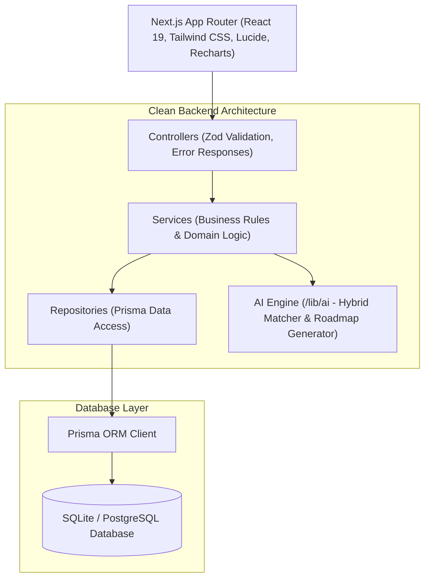

# Groearn (Unified Freelancing Platform)
> **“Learn. Earn. Work. Grow — All in One.”**

An AI-powered professional ecosystem unifying **E-Learning (Udemy)**, **Freelance & Local Jobs (Upwork)**, **1-on-1 Mentorship**, **Professional Networking (LinkedIn)**, and an **AI Career Assistant** into one connected platform.

---

## 🛠️ Technology Stack

| Layer | Technologies & Libraries | Purpose & Key Highlights |
| :--- | :--- | :--- |
| **LLM & AI Orchestration** | **LangChain** (`@langchain/core`, `@langchain/openai`) • **OpenAI** (`gpt-4o-mini`) | Dynamic prompt templates, LLM chaining, multi-turn reasoning, and dual-engine fallback. |
| **RAG (Retrieval-Augmented Generation)** | **Custom RAG Retriever** • **Prisma Context Pipeline** | Grounded retrieval of live database jobs, published courses, expert mentors, and user profile data (zero hallucination). |
| **AI Intelligence Engine** | **Skill Gap Matrix** • **ASCII Flow Generator** • **Proposal Builder** | 5-factor hybrid candidate matcher, dynamic visual ASCII roadmaps, resume skill parser, and tone polisher. |
| **Frontend Framework** | **Next.js 16.3.4** (App Router) • **React 19.2.8** | React Server Components (RSC), Turbopack bundler, client hydration, dynamic routing. |
| **Styling & Design System** | **Tailwind CSS v4** • **PostCSS** | Light theme aesthetic (`#F8FAF9` / Emerald `#16A34A`), glassmorphic overlays, responsive typography. |
| **UI Components & Icons** | **Lucide React** • **Sonner** • **Canvas Confetti** | Crisp modern SVG icons, interactive toast feedback system, gamified milestone celebrations. |
| **Data Visualization** | **Recharts 2.15** | Interactive radar charts for skill profiling, career analytics, and mentor revenue charts. |
| **Backend & API Layer** | **Next.js API Routes** (Node.js runtime) | Clean RESTful endpoints, Controller-Service-Repository architecture pattern. |
| **Data Validation & Schemas**| **Zod 3.24** • **@hookform/resolvers** | Strict runtime validation schemas for API requests, auth payloads, and AI outputs. |
| **Authentication & Security**| **Jose** • **JsonWebToken** • **Bcrypt.js** | Stateless JWT authentication, role-based access control (RBAC), salted password hashing. |
| **Database & ORM** | **Prisma ORM 6.4** • **SQLite / PostgreSQL (Neon)** | Type-safe schema migrations, relation modeling, connection pooling, and seeding. |
| **Testing & CI/CD** | **GitHub Actions** • **ESLint 9** • **TypeScript 5** • **TSX** | Automated multi-platform CI/CD pipeline (typecheck, lint, schema push, production build). |

---


## 🌟 Key Features

- **Unified Identity Evolution**: Users progress through **Learner $\rightarrow$ Professional $\rightarrow$ Mentor $\rightarrow$ Company**.
- **5-Factor Explainable AI Matcher**:
  $$\text{Score} = (\text{Skills} \times 50\%) + (\text{Experience} \times 20\%) + (\text{Location} \times 10\%) + (\text{Goal} \times 10\%) + (\text{AI Semantic} \times 10\%)$$
- **Local & Global Job Discovery**: Extensible `JobProvider` architecture supporting remote worldwide projects and on-site local gigs (e.g., Chennai, Tamil Nadu).
- **Interactive Career Roadmaps**: Step-by-step 4-phase curricula with visual ASCII workflow diagrams and milestone projects.
- **AI Proposal Generator**: Generate custom milestone proposals with timeline and architecture breakdowns.
- **Interactive Course System**: Video player, module progress tracking, mock payment checkout, and automated certificates.
- **1-on-1 Mentorship Marketplace**: Hourly rate coaching, session booking requests, and integrated video meeting rooms.
- **AI Communication Assistant**: Live message tone polisher (Professional, Friendly, Concise, Persuasive, Grammar Fix).
- **Professional Feed**: Share achievements, project launches, certifications, and hiring announcements.

---

## 🚀 Quick Start & Demo Accounts

### 1. Install & Setup
```bash
# Clone and install dependencies
npm install

# Push database schema & generate Prisma client
npx prisma db push

# Seed database with realistic users, courses, jobs, and posts
npm run seed

# Run local development server
npm run dev
```
Open [http://localhost:3000](http://localhost:3000) in your browser.

### 2. Pre-Seeded Demo Accounts (Password: `Demo1234!`)
| Role | Email | Purpose |
|---|---|---|
| **👨‍🎓 Learner** | `student@example.com` | AI Skill Gap Analysis, Course Progress, Career Roadmap |
| **💼 Professional** | `professional@example.com` | Local/Global Jobs, Resume Parsing, AI Proposal Generator |
| **👨‍🏫 Mentor** | `mentor@example.com` | Student Coaching Requests, Video Meetings, Course Publishing |
| **🏢 Company** | `company@example.com` | Post Jobs, AI Talent Search, Applicant Tracking Pipeline |

*Tip: The Landing Page and Login Page include 1-click autofill buttons for instant testing.*

---

## 🏗️ Architecture & Layered Structure



---

## 📁 Project Structure

```
g:/ufp/
├── src/
│   ├── app/                    # Next.js App Router (Pages & API Routes)
│   │   ├── api/                # REST API Endpoints (Auth, Jobs, Courses, AI, Mentors, Posts)
│   │   ├── student/dashboard   # Learner Hub & AI Skill Profiling
│   │   ├── professional/dashboard# Professional Workspace & AI Proposal Generator
│   │   ├── mentor/dashboard    # Mentor Coaching Studio & Request Management
│   │   ├── company/dashboard   # Company Hiring Pipeline & Candidate Search
│   │   ├── feed/               # Professional Social Feed
│   │   ├── jobs/               # Global & Local Job Directory
│   │   ├── courses/            # Interactive Course Catalog & Video Player
│   │   ├── mentors/            # Mentor Directory & 1-on-1 Booking
│   │   ├── ai-assistant/       # AI Career Advisor & Message Polisher
│   │   └── profile/            # Dynamic Portfolio & Skills Management
│   ├── components/             # Reusable UI & Layout Components
│   ├── context/                # Client Auth Context & Role Switcher
│   ├── controllers/            # API Route Controllers
│   ├── services/               # Business Service Layer
│   ├── repositories/           # Database Query Repositories
│   ├── validators/             # Zod Validation Schemas
│   └── lib/                    # Prisma Singleton, Auth JWT, & AI Engine
├── prisma/
│   ├── schema.prisma           # Prisma Relational Schema
│   └── seed.ts                 # Database Seed Script
└── docs/                       # Architecture & API Documentation
```

---

## 🧪 Verification & CI/CD

```bash
# Run AI assistant test suite
npx tsx src/lib/__tests__/ai-assistant.test.ts

# Run Job posting integration test suite
npx tsx src/lib/__tests__/job-posting.test.ts

# Run ESLint code quality check
npm run lint

# Next.js production build
npm run build
```
Automated GitHub Actions CI pipeline is configured in `.github/workflows/ci.yml`.

