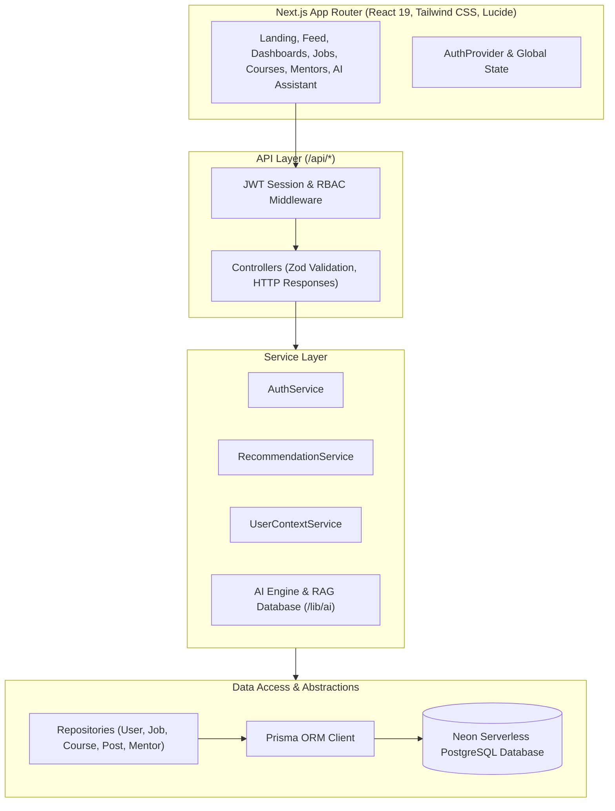

# Growearn — Architecture Overview

## 1. System Design & Architectural Vision

**Growearn** bridges the fragmented tech talent journey:
$$\text{Learn (Courses)} \longrightarrow \text{Work & Gigs (Jobs)} \longrightarrow \text{Mentorship} \longrightarrow \text{Network (Community)} \longrightarrow \text{AI Guidance (RAG)}$$

## 2. Clean Layered Architecture Principles

1. **Controllers (`src/controllers/`)**: Validate request inputs via Zod schemas and format HTTP status codes using `apiSuccess` and `apiError`.
2. **Services (`src/services/`)**: Encapsulate business logic, orchestration, and domain rules.
3. **Repositories (`src/repositories/`)**: Abstract Prisma queries and database interactions.
4. **AI & RAG Engine (`src/lib/ai/`)**: Deterministic 5-factor hybrid scoring algorithms, vector & TF-IDF cosine similarity RAG database, and LLM orchestration.
