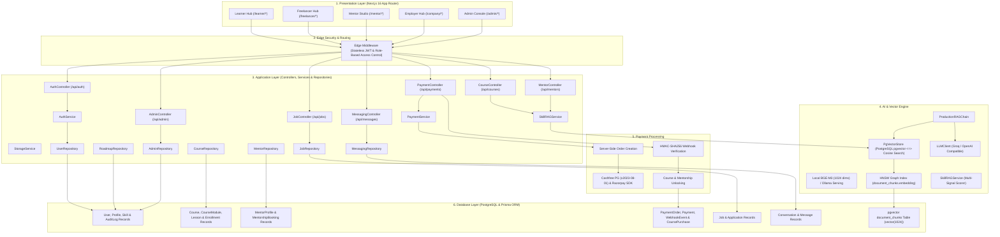

# System Architecture

## 1. System Overview

GroEarn connects learning, mentorship, freelance contracts, and company hiring into a single platform:

$$\text{Learn Roadmaps} \longrightarrow \text{Complete Courses} \longrightarrow \text{1-on-1 Mentorship} \longrightarrow \text{Freelance Gigs} \longrightarrow \text{Full-Time Hiring} \longrightarrow \text{Mentor Others}$$

```mermaid
graph TD
    subgraph Presentation_Layer["1. Presentation Layer (Next.js 16 App Router)"]
        UI_Learner["Learner Hub (/learner/*)"]
        UI_Freelancer["Freelancer Hub (/freelancer/*)"]
        UI_Mentor["Mentor Studio (/mentor/*)"]
        UI_Employer["Employer Hub (/company/*)"]
        UI_Admin["Admin Console (/admin/*)"]
    end

    subgraph Security_Layer["2. Edge Security & Routing"]
        MW["Edge Middleware (Stateless JWT & Role-Based Access Control)"]
    end

    subgraph Application_Layer["3. Application Layer (Controllers, Services & Repositories)"]
        Ctrl_Auth["AuthController (/api/auth)"]
        Ctrl_Job["JobController (/api/jobs)"]
        Ctrl_Course["CourseController (/api/courses)"]
        Ctrl_Mentor["MentorController (/api/mentors)"]
        Ctrl_Payment["PaymentController (/api/payments)"]
        Ctrl_Msg["MessagingController (/api/messages)"]
        Ctrl_Admin["AdminController (/api/admin)"]
        
        Svc_Auth["AuthService"]
        Svc_Payment["PaymentService"]
        Svc_SkillRAG["SkillRAGService"]
        Svc_Storage["StorageService"]
        
        Repo_User["UserRepository"]
        Repo_Job["JobRepository"]
        Repo_Course["CourseRepository"]
        Repo_Mentor["MentorRepository"]
        Repo_Msg["MessagingRepository"]
        Repo_Roadmap["RoadmapRepository"]
        Repo_Admin["AdminRepository"]
    end

    subgraph AI_RAG_Layer["4. AI & Vector Engine"]
        Embeddings["Local BGE-M3 (1024 dims) / Ollama Serving"]
        VectorStore["PgVectorStore (PostgreSQL pgvector <=> Cosine Search)"]
        HNSW["HNSW Graph Index (document_chunks.embedding)"]
        Skill_RAG["SkillRAGService (Multi-Signal Scorer)"]
        RAG_Chain["ProductionRAGChain"]
        LLM_Client["LLMClient (Groq / OpenAI Compatible)"]
    end

    subgraph Payments_Layer["5. Payment Processing"]
        Payment_Providers["Cashfree PG (v2023-08-01) & Razorpay SDK"]
        Payment_Orders["Server-Side Order Creation"]
        Payment_Webhook["HMAC-SHA256 Webhook Verification"]
        Payment_Entitlements["Course & Mentorship Unlocking"]
    end

    subgraph Persistence_Layer["6. Database Layer (PostgreSQL & Prisma ORM)"]
        DB_Users["User, Profile, Skill & AuditLog Records"]
        DB_Courses["Course, CourseModule, Lesson & Enrollment Records"]
        DB_Mentors["MentorProfile & MentorshipBooking Records"]
        DB_Payments["PaymentOrder, Payment, WebhookEvent & CoursePurchase"]
        DB_Jobs["Job & Application Records"]
        DB_Msg["Conversation & Message Records"]
        DB_PgVector["pgvector document_chunks Table (vector(1024))"]
    end

    UI_Learner --> MW
    UI_Freelancer --> MW
    UI_Mentor --> MW
    UI_Employer --> MW
    UI_Admin --> MW

    MW --> Ctrl_Auth
    MW --> Ctrl_Job
    MW --> Ctrl_Course
    MW --> Ctrl_Mentor
    MW --> Ctrl_Payment
    MW --> Ctrl_Msg
    MW --> Ctrl_Admin

    Ctrl_Auth --> Svc_Auth
    Ctrl_Course --> Svc_SkillRAG
    Ctrl_Mentor --> Svc_SkillRAG
    Ctrl_Payment --> Svc_Payment
    Ctrl_Job --> Repo_Job
    Ctrl_Msg --> Repo_Msg
    Ctrl_Admin --> Repo_Admin

    Svc_Payment --> Payment_Orders
    Payment_Orders --> Payment_Providers
    Ctrl_Payment --> Payment_Webhook
    Payment_Webhook --> Payment_Entitlements
    Payment_Entitlements --> DB_Payments

    Svc_SkillRAG --> VectorStore
    VectorStore --> HNSW
    HNSW --> DB_PgVector
    RAG_Chain --> VectorStore
    RAG_Chain --> LLM_Client

    Svc_Auth --> Repo_User
    Repo_User --> DB_Users
    Repo_Job --> DB_Jobs
    Repo_Course --> DB_Courses
    Repo_Mentor --> DB_Mentors
    Repo_Msg --> DB_Msg
    Repo_Roadmap --> DB_Users
    Repo_Admin --> DB_Users
```

---

## 2. Layer Responsibilities

1. **Next.js App Router**: Implements server and client components, layout hierarchies, and API route handlers.
2. **Edge Middleware (`src/middleware.ts`)**: Validates stateless JWT tokens on protected route patterns and handles canonical redirects.
3. **Controllers (`src/controllers/`)**: Validates input data with Zod schemas and coordinates services and repositories.
4. **Services (`src/services/`)**: Implements core business logic such as payment lifecycle, storage abstractions, and authentication workflows.
5. **Repositories (`src/repositories/`)**: Encapsulates Prisma ORM queries with explicit field selections.
6. **AI Layer (`src/lib/ai/`)**: Handles vector generation via local BGE-M3 (1024-dim), pgvector cosine search, hybrid scoring, and LLM inference.
7. **Database (`prisma/schema.prisma`)**: PostgreSQL relational models with foreign keys, unique constraints, and pgvector extension (`vector(1024)`).

---

## 3. Canonical Role Routing

| Role | Primary Route | Description |
| :--- | :--- | :--- |
| **LEARNER** | `/learner/dashboard` | Skill-first RAG roadmaps, course enrollment, mentorship bookings |
| **FREELANCER** | `/freelancer/dashboard` | Semantic job matching, proposal builder, application tracker |
| **MENTOR** | `/mentor/dashboard` | Course creation studio, student booking requests, earnings telemetry |
| **COMPANY** | `/company/dashboard` | Job posting studio, ATS candidate pipeline |
| **ADMIN** | `/admin/dashboard` | System telemetry, user moderation, immutable audit logs |
