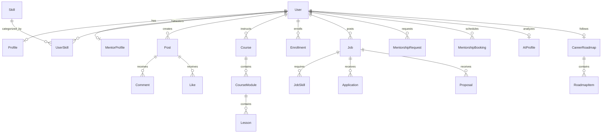

# Database Architecture & Entity Relationships

The relational model is designed in Prisma ORM with strict normalization, relational foreign keys, cascade deletes, and indexing.

## Relational Models Summary

| Model | Purpose |
|---|---|
| `User` | Core identity with email, password hash, role (`STUDENT`, `MENTOR`, `FREELANCER`, `COMPANY`), location, and bio. |
| `Profile` | Portfolio URLs, hourly rate, career goals, AI score, and company metadata. |
| `Skill` & `UserSkill` | Verified competencies with proficiency levels (`BEGINNER`, `INTERMEDIATE`, `ADVANCED`, `EXPERT`). |
| `Job` & `JobSkill` | Full-time and freelance listings with work mode (`REMOTE`, `ONSITE`, `HYBRID`), local indicators, and salary range. |
| `Course`, `CourseModule`, `Lesson` | Interactive video course catalog with lesson progress tracking and automated certificate generation. |
| `MentorshipRequest` & `Booking` | 1-on-1 coaching requests, meeting room links, and ratings. |
| `AIProfile` & `CareerRoadmap` | Skill gap analysis, target role roadmaps, and step-by-step milestone linkages. |
